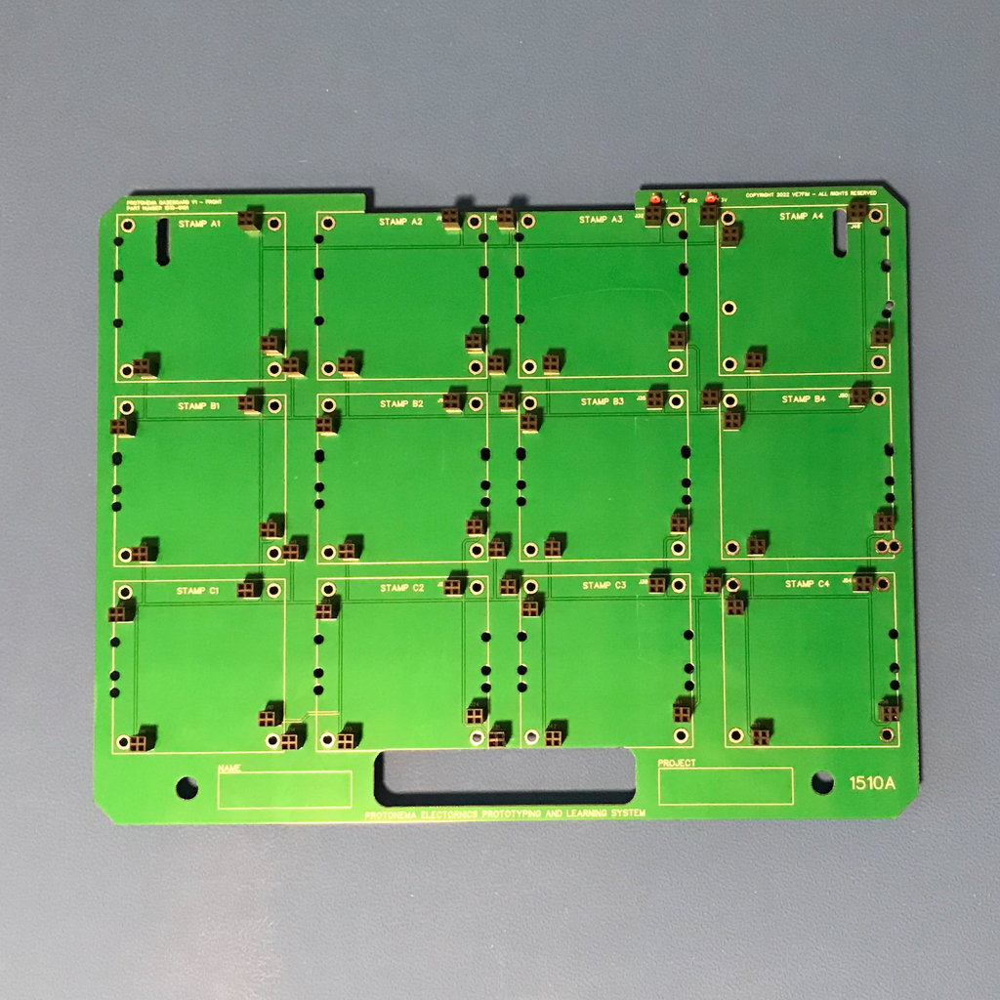

# Protonema Baseboard

## Project Status

Definition | Prototype HW | Final HW | Software | Assembly Docs | Usage Docs |
|-|-|-|-|-|-|
100% | 100% | 100% | N/A | 90% | 0% |

## Project Overview
The Protonema baseboard is a letter-sized portable prototyping board various stamps can be attached.

## Project Goals
* Provide a portable prototyping board that can accommodate a variety of combinations of breadboard and stamps.

## Project Deliverables
* Baseboard PCB design
* [Assembly documentation](./1510-8010.pdf)