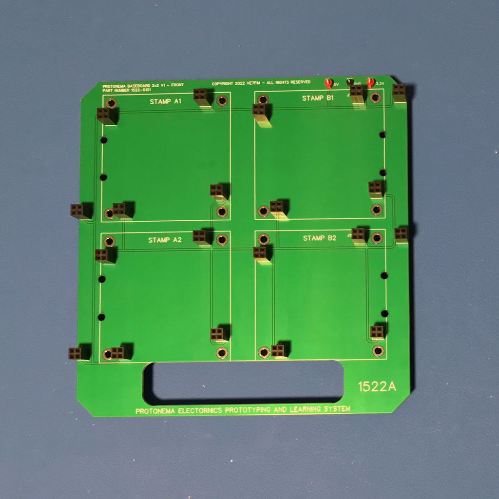

# Protonema 2x2 Baseboard

## Project Status

Definition | Prototype HW | Final HW | Software | Assembly Docs | Usage Docs |
|-|-|-|-|-|-|
100% | 100% | 100% | N/A | 80% | 0% |

## Project Overview
The Protonema 1522A baseboard is a compact portable prototyping board that up to four stamps can be attached to.

## Project Goals
* Provide a low-cost, compact and portable prototyping board that can accommodate a variety of combinations of breadboard and stamps.

## Project Deliverables
* [Baseboard PCB design](https://github.com/dslik/protonema/tree/main/stamps/1522A/1522-0101/latest)
* [Assembly documentation](https://dslik.github.io/protonema/baseboards/1522A/1522-8010.pdf)
