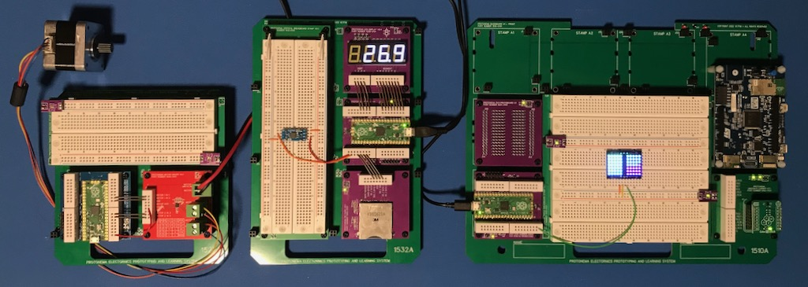

Left: A 2x2 baseboard with a stepper motor controller, a Raspberry Pi Pico and a breadboard.

Center: A 3x2 baseboard with a four-digit LED display, a Raspberry Pi Pico, a SD card adapter, and a temperature sensor on a breadboard, acting as a temperature logger.

Right: A 3x4 baseboard with a Raspberry Pi Pico, a perfboard stamp, a larger breadboarding area with a Pixie Chroma display, an ST discovery board, and a mikroBUS™ Click™ adapter.

## Project Overview
Protonema is an low-cost electronics prototyping and learning system designed to combine the best of breadboarding, microprocessors and surface mount technologies into a single easy-to-use and easy-to-extend system for rapid electronics prototyping and development.

Protonema includes:
* [Baseboards](baseboards/readme.md) that distribute power.
* [Stamps](stamps/readme.md) that provide modular building blocks and breadboarding areas.
* [Guides](guides/readme.md) that provide assembly instructions and theory of operations.

## Project Goals
* Approachable: Combine the best of the classic "100-in-one" electronics kits with modern microcontrollers and digital logic.
* Low cost: Target cost is less than $50, making it suitable for classroom use.
* Open source: Available for use and extension with minimal restrictions. See the [license](./license,md) for more details.
* Extensible: Pluggable [stamps](stamps/readme.md) implement functions not easily constructed on a breadboard. This allows the system to be used to teach and prototype a wide variety of different subject areas, including power electronics, computer organization, audio processing, etc.
* Built-in 3V3 and 5V power distribution, with clear visual indication of power domains

## Components

Part # | Name | Status | OSHWA | Cert # |
|-|-|-|-|-|
| [1011A](./stamps/1011A) v1.0 | Horizontal Breadboard Stamp | Complete |  |  [CA000016](https://certification.oshwa.org/ca000016.html)  |
| [1031A](./stamps/1031A) v1.1 | Raspberry Pi Pico Stamp | Complete |  | |
| [1510A](./baseboards/1510A) v1.0 | 3x4 Baseboard | Complete |  | [CA000015](https://certification.oshwa.org/ca000015.html) |
