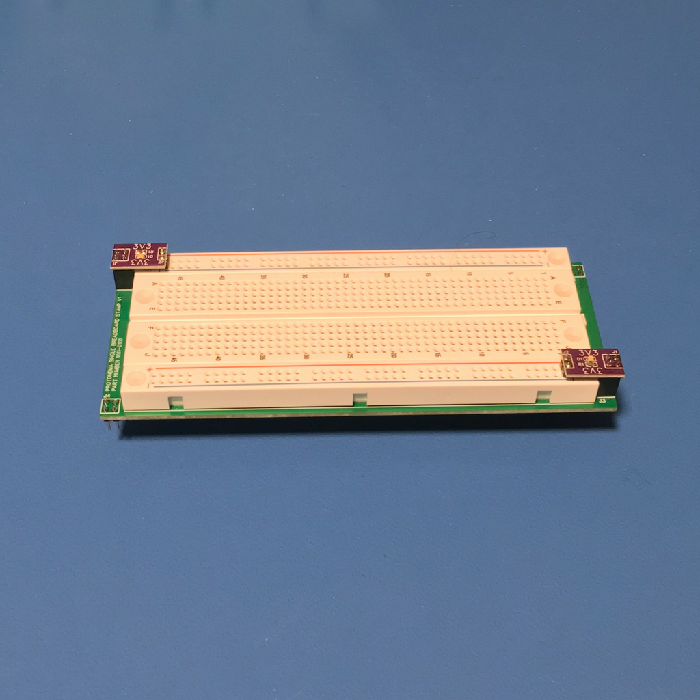

# Protonema Horizontal Breadboard

## Project Status

Definition | Prototype HW | Final HW | Software | Assembly Docs | Usage Docs |
|-|-|-|-|-|-|
100% | 100% | 100% | N/A | 100% | N/A |

## Project Overview
The Protonema Horizontal Breadboard occupies two horizontal stamps and provides a 47 row breadboarding area for prototyping.

## Project Goals
* Provide a small breadboard for prototyping.

## Project Deliverables
* [Stamp PCB design](https://github.com/dslik/protonema/tree/main/stamps/1011A/1011-0101/latest)
* [Assembly documentation](https://dslik.github.io/protonema/stamps/1011A/1011-8010.pdf)
