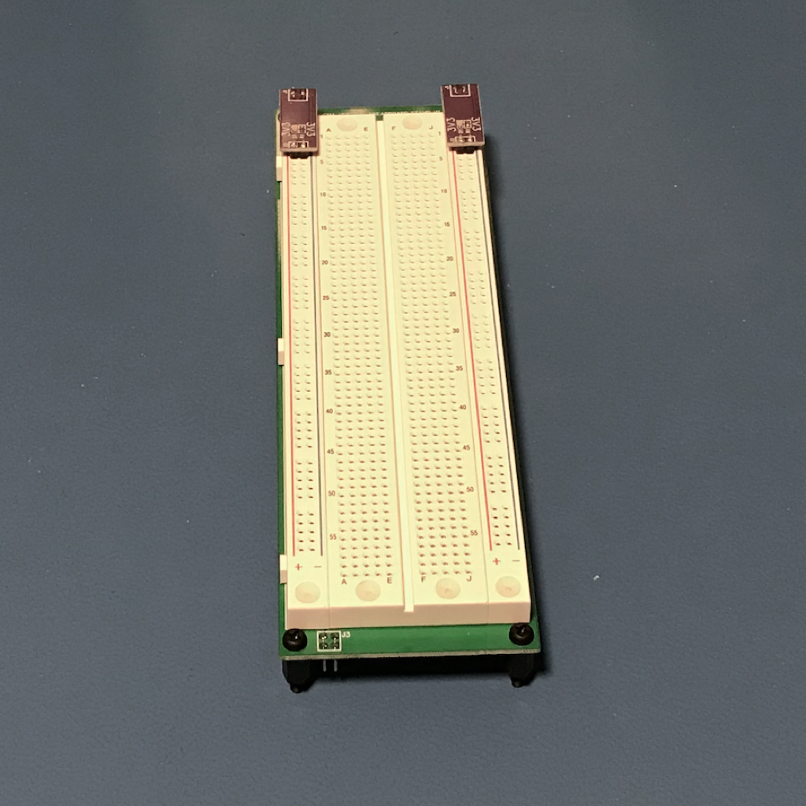

# Protonema Vertical Breadboard

## Project Status

Definition | Prototype HW | Final HW | Software | Assembly Docs | Usage Docs |
|-|-|-|-|-|-|
100% | 100% | 100% | N/A | 100% | N/A |

## Project Overview
The Protonema Vertical Breadboard occupies three stamps and provides a 59 row breadboarding area for prototyping.

## Project Goals
* Provide a medium-sized breadboard for prototyping.

## Project Deliverables
* Stamp PCB design
* [Assembly documentation](https://dslik.github.io/protonema/stamps/1012A/1012-8010.pdf)
