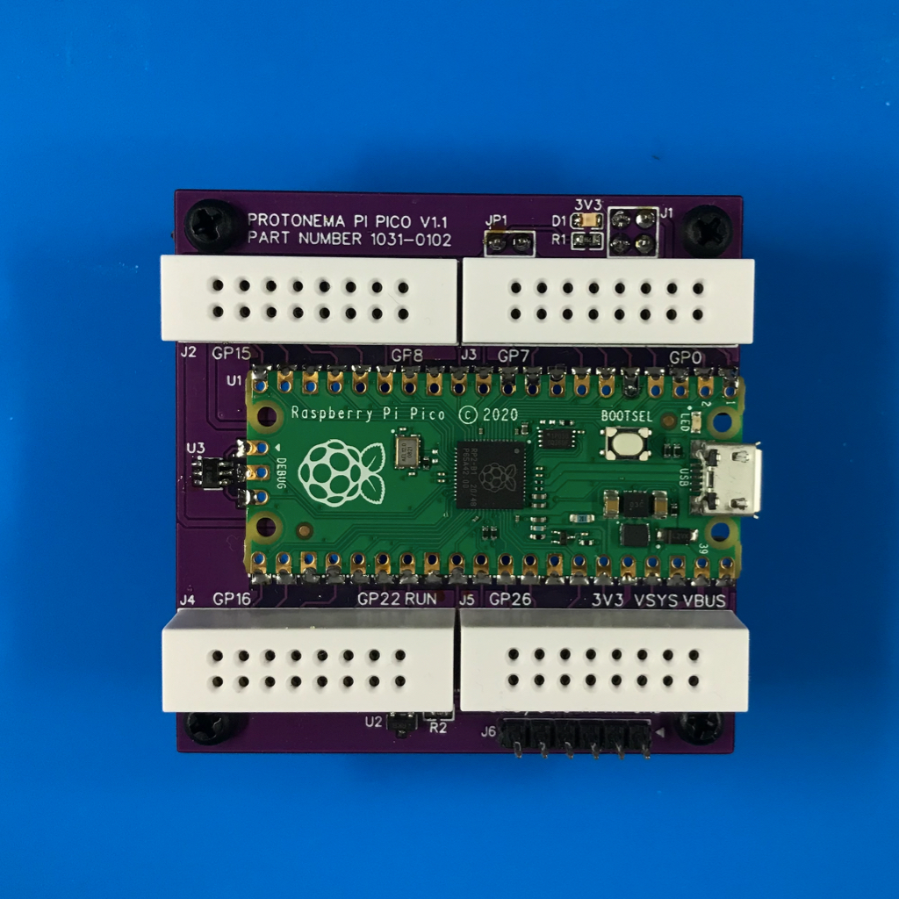

# Protonema Pi Pico Board

## Project Status

Definition | Prototype HW | Final HW | Software | Assembly Docs | Usage Docs |
|-|-|-|-|-|-|
100% | 100% | 100% | 100% | 90% | 0% |

## Project Overview
The Protonema Pi Pico board allows a Raspberry Pi microcontroller to be connected to protonema circuits.

Version 1.2 switches over to the standard [Pi Pico 3-pin debugging connectors](https://datasheets.raspberrypi.com/debug/debug-connector-specification.pdf). You can also order these boards with all SMT components pre-assembled from JLCPCB.

## Project Goals
* Provide a starting point for experimenting with and programming Pi Pico microcontrollers.

## Project Deliverables
* [Stamp PCB design](https://github.com/dslik/protonema/tree/main/stamps/1031A/1031-0102/latest)
* [Assembly documentation](https://dslik.github.io/protonema/stamps/1031A/1031-8010.pdf)
* [Sample software](https://github.com/dslik/protonema/tree/main/stamps/1031A/1031-9101)
* Pi Pico Experimenters Guide

## Important Copyright Notice

The PCB designs in the 1031-0101 directory include copyrighted artwork used under license. Use the PCB designs in the 1031-0102 directory instead.

The 1031-0101 PCB designs may only to be used if a license is secured through the [Powered by Raspberry Pi](https://www.raspberrypi.com/for-industry/powered-by/) program.