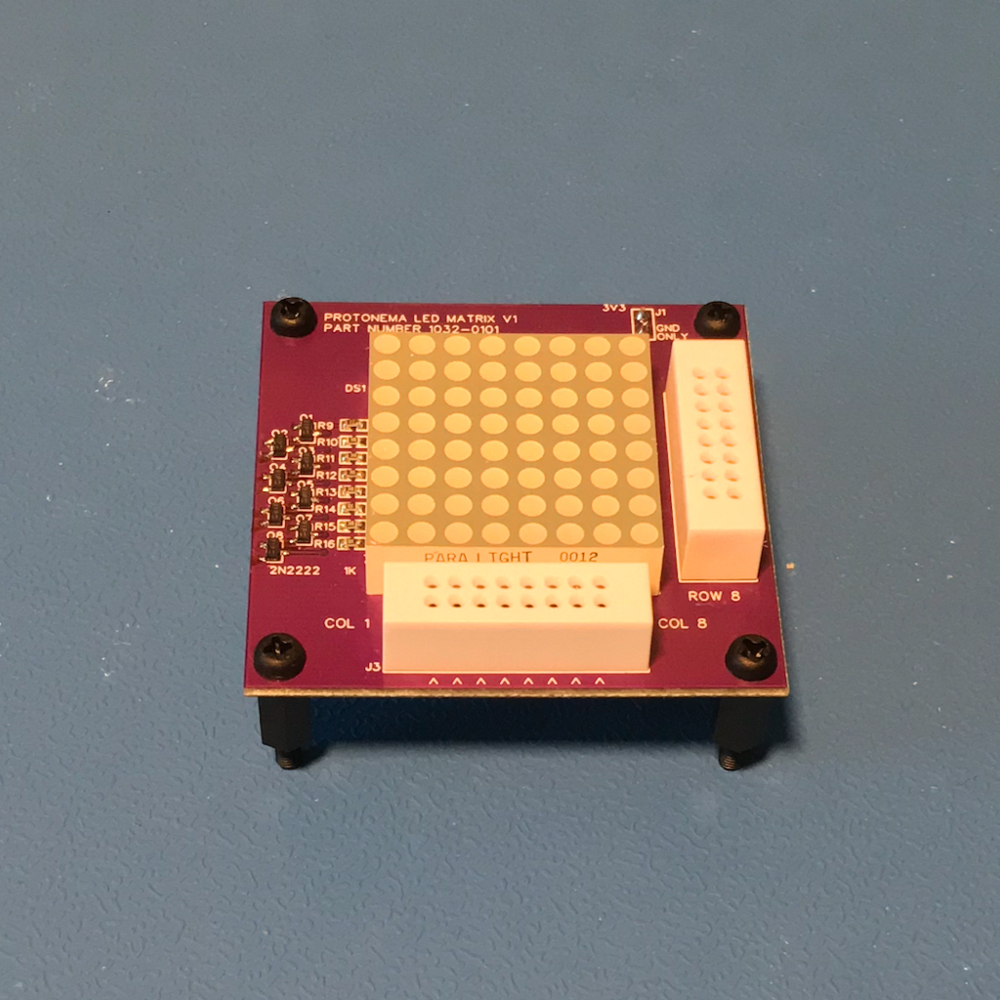

# Protonema LED Matrix Stamp

## Project Status

Definition | Prototype HW | Final HW | Software | Assembly Docs | Usage Docs |
|-|-|-|-|-|-|
100% | 100% | 100% | 100% | 90% | 0% |

## Project Overview
The Protonema LED matrix stamp demonstrates how to drive an 8x8 LED matrix display using multiplexing.

## Project Goals
* Provide a starting point for experimenting with LED multiplexing, and to provide a display for showing values.

## Project Deliverables
* [Stamp PCB design](https://github.com/dslik/protonema/tree/main/stamps/1032A/1032-0101/latest)
* [Assembly documentation](https://dslik.github.io/protonema/stamps/1032A/1032-8010.pdf)
* [Sample software - Counter](https://github.com/dslik/protonema/tree/main/stamps/1032A/1032-9101)
* [Sample software - Temperature Display](https://github.com/dslik/protonema/tree/main/stamps/1032A/1032-9102)
* LED Matrix Experimenters Guide
