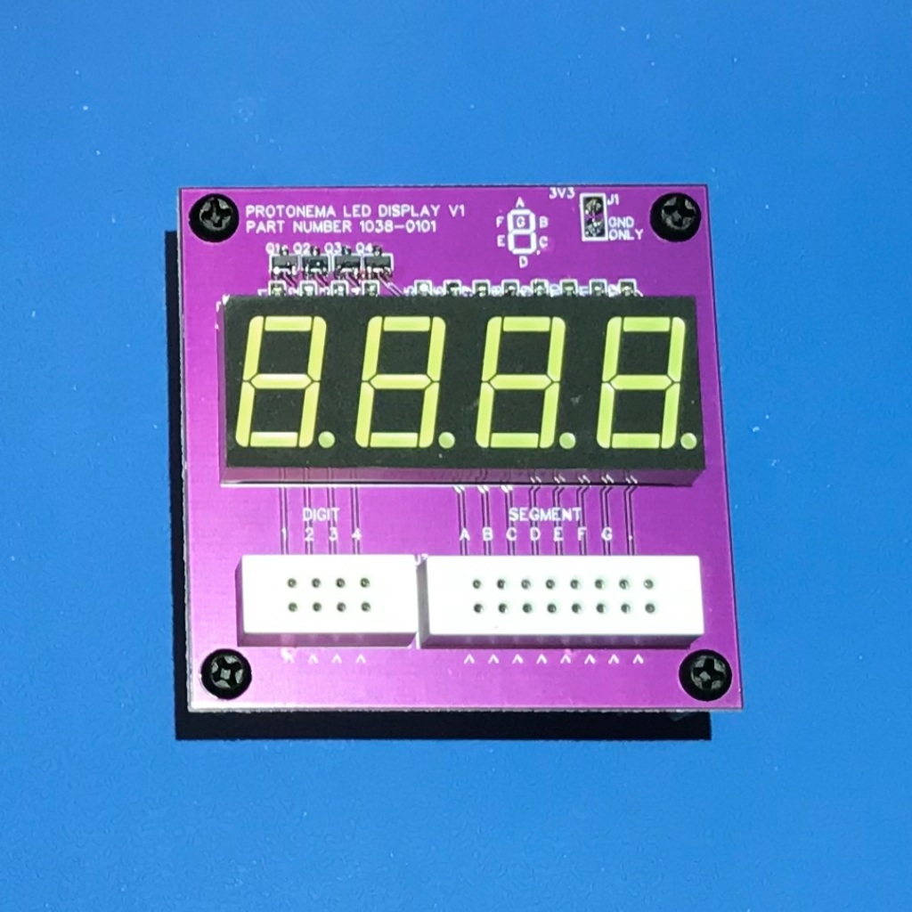

# Protonema LED Display Stamp

## Project Status

Definition | Prototype HW | Final HW | Software | Assembly Docs | Usage Docs |
|-|-|-|-|-|-|
100% | 100% | 100% | 100% | 90% | 0% |

## Project Overview
The Protonema LED Display stamp demonstrates how to drive a four-digit LED display using multiplexing.

## Project Goals
* Provide a starting point for experimenting with LED multiplexing, and to provide a display for showing values.

## Project Deliverables
* [Stamp PCB design](https://github.com/dslik/protonema/tree/main/stamps/1038A/1038-0102/latest)
* [Assembly documentation](https://dslik.github.io/protonema/stamps/1038A/1038-8010.pdf)
* [Sample software](https://github.com/dslik/protonema/tree/main/stamps/1038A/1038-9101)
* LED Display Experimenters Guide
