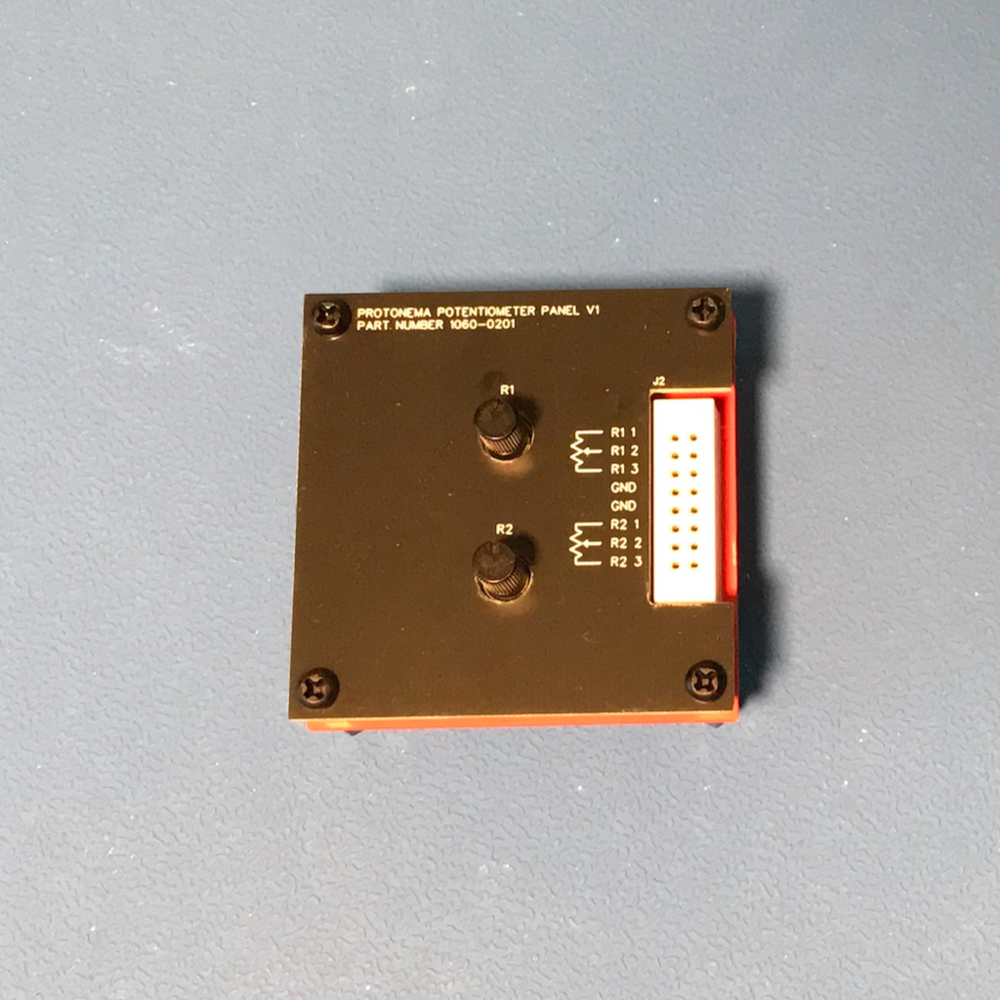

# Protonema Dual Potentiometer Stamp

## Project Status

Definition | Prototype HW | Final HW | Software | Assembly Docs | Usage Docs |
|-|-|-|-|-|-|
100% | 100% | 100% | 100% | 100% | 0% |

## Project Overview
The Protonema dual poteniometer stamp provides two potentiometers for analog circuit experimentation.

## Project Goals
* Provide controls for use in analog circuits.

## Project Deliverables
* [Stamp PCB design](https://github.com/dslik/protonema/tree/main/stamps/1060A/1060-0101/latest)
* [Assembly documentation](https://dslik.github.io/protonema/stamps/1060A/1060-8010.pdf)
* [Sample software - Display Voltage ](https://github.com/dslik/protonema/tree/main/stamps/1060A/1060-9101)
