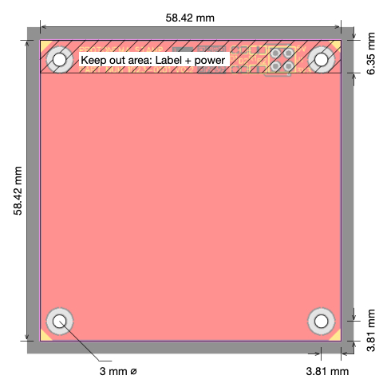

Protonema stamps provide various functions for building projects.

### 1031A Stamp - Raspberry Pi Pico Stamp

The Raspberry Pi Pico stamp allows for experimentation with microcontrollers using the RP2040. All I/O lines are available, plus a higher precision 3.0 volt reference for analog to digital conversion.

### 1032A Stamp - LED Matrix Stamp

The LED Matrix stamp is an 8x8 LED matrix that can be used to display small images and create simple games. It is connected to a processor stamp using multiplexed GPIO lines.

### 1038A Stamp - LED Display Stamp

The LED Display stamp is a 4 digit seven-segment LED display that can be used to display small numeric values. It is connected to a processor stamp using multiplexed GPIO lines.

### 1052A Stamp - Quad 3.5mm Jack Stamp

 

The quad 3.5mm jack stamp allows you to connect 3.5mm cables to your project, for example, when prototyping Eurorack synth modules. Two jacks are labelled for inputs, and two jacks are labelled for outputs.

### 1060A Stamp - Dual Potentiometers Stamp

 

The dual potentiometer stamp allows you add two variable resistors to your project.

### 1068A Stamp - Intelligent Display Stamp

The Intelligent Display stamp is a 4 character smart display that can be used to display small text messages and custom graphics. It is connected to a processor stamp using a simple serial protocol.

### 1094A Stamp - Sliders Stamp

 

The sliders stamp two slide-style variable resistors to your project, each with a LED.

# Breadboard Stamps

### 1011A Horizontal Breadboard Stamp

### 1012A Vertical Breadboard Stamp

### 1013A Triple Breadboard Stamp

### 1015A Mini Breadboard Stamp

# Templates

### 1020A-1024A Stamps - Templates

 
  
 

Use these as a starting point for creating your own stamps.

