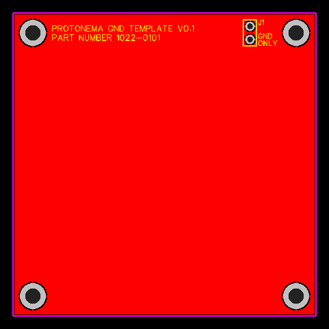

Protonema stamps provide various functions for building projects.

### 1020A/1021A/1022A Stamps - Templates

 
 

Use these as a starting point for creating your own stamps.

### 1031A Stamp - Raspberry Pi Pico

The Raspberry Pi Pico stamp allows for experimentation with microcontrollers using the RP2040. All I/O lines are available, plus a higher precision 3.0 volt reference for analog to digital conversion.

